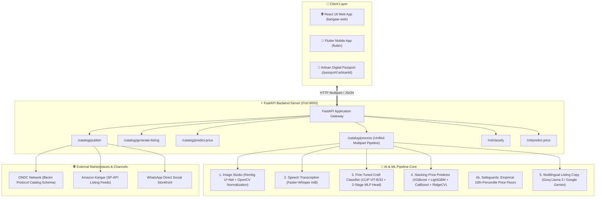
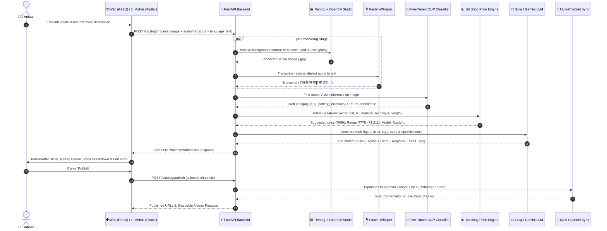

# 🎨 KarigaarAI (कारीगर AI) - Complete Project Architecture & System Documentation

> **Empowering Indian Artisans through AI-Powered Multilingual Cataloging, Fine-Tuned Craft Intelligence, Fair Pricing, and Multi-Platform E-Commerce Sync.**

---

## 📌 1. Project Overview & Mission

**KarigaarAI** is an AI-first platform purpose-built to bridge the digital divide for traditional Indian artisans and craftspeople. Many artisans possess mastery in craftwork (pottery, handloom textiles, woodwork, brassware, etc.) but face friction with digital literacy, professional studio photography, multi-language product copywriting, fair market pricing, and multi-channel marketplace distribution.

KarigaarAI solves this through a voice-first, multi-platform workflow:
1. 📸 **Snap a Photo** of the handcrafted product on any phone or web client.
2. 🎙️ **Speak Naturally** in any Indian regional language (Hindi, Tamil, Bengali, Marathi, etc.) describing materials, technique, and heritage.
3. ⚡ **5-Stage AI/ML Engine** handles image background removal & studio lighting, speech transcription, fine-tuned craft categorization (CLIP ViT-B/32), fair price prediction (Stacking ensemble + price floors), and SEO-optimized multilingual catalog generation.
4. 🌐 **1-Click Multi-Channel Sync** distributes the listing to ONDC, Amazon Karigar, WhatsApp storefronts, and digital identity passports.

---

## 🏛️ 2. High-Level Architecture Diagram



---

## 🔌 3. Component Connections & Data Flow

### 🔄 End-to-End Workflow: From Photo to Multi-Platform Listing



---

## 📁 4. Project Directory Map & File Responsibilities

### 📂 Root Directory
```
KarigaarAI/
├── backend/                   # FastAPI Backend and AI/ML Service
├── karigaar-web/              # React 18 + Vite Web Client (Claymorphism UI)
├── flutter/                   # Flutter Cross-Platform Mobile Application
├── 03_ai_pipeline_doc.md      # AI pipeline technical specifications
├── DEVELOPER_HANDOFF.md       # Teammate handoff spec for Amazon & ONDC sync
├── Knowledgetransfer.md       # Developer onboarding & architecture summary
├── PROJECT_DOCUMENTATION.md   # Complete system architecture (This file)
├── RUNNING.md                 # Local setup and execution guide
```

---

### 📂 Backend Architecture (`/backend`)

| Directory / File | Description & Connections |
| :--- | :--- |
| **`app/main.py`** | FastAPI entry point, lifespan initialization, CORS middleware, static `/temp` mounts. |
| **`app/core/config.py`** | Pydantic Settings, environment variables (`GROQ_API_KEY`, `GEMINI_API_KEY`, model paths). |
| **`app/core/responses.py`** | Standardized API response format (`ApiResponse` envelope with `status`, `data`, `message`). |
| **`app/models/schemas.py`** | Pydantic data schemas: `ProcessProductData`, `GenerateListingRequest`, `ProductListingPublishRequest`. |
| **`app/routers/catalog_router.py`** | Main catalog pipeline router handling `/catalog/process`, `/catalog/publish`. |
| **`app/routers/ml_router.py`** | Standalone ML endpoints: `/ml/classify` and `/ml/predict-price`. |
| **`app/ai/image_enhancer.py`** | Background removal via `rembg`, drop shadow generation, and OpenCV white-balancing. |
| **`app/ai/transcriber.py`** | Local `faster-whisper` speech-to-text inference with Indian regional dialect support. |
| **`app/ai/listing_generator.py`** | Prompt orchestration with Groq (Llama 3.1 8B/70B) & Gemini 1.5 Flash for multi-language copy. |
| **`app/ml/classifier.py`** | **Fine-tuned CLIP ViT-B/32 vision classifier** with 2-stage MLP head and NLP fallback. |
| **`app/ml/price_predictor.py`** | **Stacking Ensemble Engine** (RidgeCV over XGBoost, LightGBM, CatBoost) with empirical price floors. |
| **`app/ml/weights/`** | Model checkpoints (`craft_classifier_finetuned.pt`, `stacking_model.pkl`, `category_price_floors.json`, etc.). |
| **`app/services/`** | Service abstractions (`image_service.py`, `speech_service.py`, `llm_service.py`, `marketplace_service.py`). |

---

### 📂 Web Frontend Architecture (`/karigaar-web`)

| Directory / File | Description & UI Components |
| :--- | :--- |
| **`src/App.jsx`** | Router configuration (`/`, `/catalog`, `/passport/:artisanId`, `/dashboard`). |
| **`src/pages/CatalogPage.jsx`** | 4-step interactive wizard: Language $\rightarrow$ Media Upload $\rightarrow$ AI Processing $\rightarrow$ Listing Preview & Publish. |
| **`src/pages/ArtisanPassport.jsx`** | Digital artisan identity card with QR code and shareable WhatsApp store links. |
| **`src/components/PassportCard.jsx`** | Claymorphic craft certificate ID card with GI badges and craft metrics. |
| **`src/components/GITagBanner.jsx`** | Contextual awareness banner highlighting 20–40% price premiums for GI-tagged crafts. |
| **`src/components/ListingPreview.jsx`** | Interactive Before/After image comparison slider and editable listing form. |
| **`src/store/catalogStore.js`** | Zustand state management storing uploaded files, previews, and pipeline results. |
| **`src/styles/clay.css`** | Custom 3D Claymorphic styling tokens (tactile drop shadows and pastel palettes). |

---

## 🧠 5. The 5 AI & ML Pipelines Explained

```
                     ┌───────────────────────────────┐
                     │ Raw Product Image + Voice Clip │
                     └───────────────┬───────────────┘
                                     │
      ┌──────────────────────────────┴──────────────────────────────┐
      ▼                                                             ▼
[Pipeline 1: Image Studio]                              [Pipeline 2: Voice STT]
- Rembg U²-Net Background Removal                       - Faster-Whisper int8 STT
- OpenCV Histogram Normalization                         - Indian Dialect Auto-Detect
- Studio Drop Shadow & 1:1 Canvas                        - Transcript Extraction
      │                                                             │
      └──────────────────────────────┬──────────────────────────────┘
                                     │
                                     ▼
                        [Pipeline 3: Fine-Tuned CLIP Classifier]
                        - Base: openai/clip-vit-base-patch32
                        - Custom 2-Stage MLP Head (LayerNorm + GELU + Dropout)
                        - 8 Craft Categories (95.7%+ Precision)
                                     │
                                     ▼
                        [Pipeline 4: Stacking Price Engine]
                        - Base Models: XGBoost + LightGBM + CatBoost
                        - Meta-Learner: RidgeCV on 26,796 scraped craft products
                        - Empirical 10th-Percentile Price Floor Safeguards
                                     │
                                     ▼
                        [Pipeline 5: Multilingual Catalog Generator]
                        - Groq (Llama 3.1) / Google Gemini 1.5 Flash
                        - English, Hindi, and Regional Cultural Narratives
                        - Search Tags, Material Detection & Care Specs
```

---

## 🚀 6. Execution & Testing Cheat Sheet

| Task | Command |
| :--- | :--- |
| **Run Backend Server** | `cd backend; .\venv\Scripts\activate; uvicorn app.main:app --reload --host 0.0.0.0 --port 8000` |
| **Run Web Client** | `cd karigaar-web; npm run dev` (Access via `http://localhost:5173`) |
| **Run Flutter Mobile App** | `cd flutter; flutter run` |
| **Test ML Inference CLI** | `python -c "from app.ml.classifier import classify_craft; print(classify_craft('Test_Image.webp'))"` |
| **Swagger API Docs** | Open browser to `http://localhost:8000/docs` |
